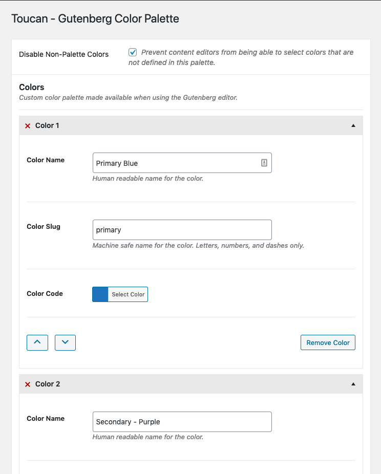
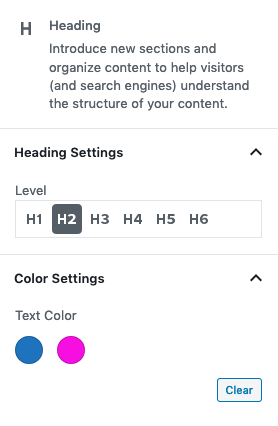

# Toucan - Gutenberg Color Palette

This WordPress plugin allows site administrators to manage the color palette available in the Gutenberg editor. It also
allows administrators to disable the ability for content writers to choose custom colors.

Photo by [Zdeněk Macháček](https://unsplash.com/@zmachacek?utm_source=unsplash&utm_medium=referral&utm_content=creditCopyText) on [Unsplash](https://unsplash.com/s/photos/toucan?utm_source=unsplash&utm_medium=referral&utm_content=creditCopyText)

## How to use

1. Download and install this plugin
1. Visit Settings > Toucan Colors
1. Create your color palette  

## Screenshots

Creating your color palette on Settings > Toucan Colors page

Custom colors shown in Gutenberg editor for text colors

